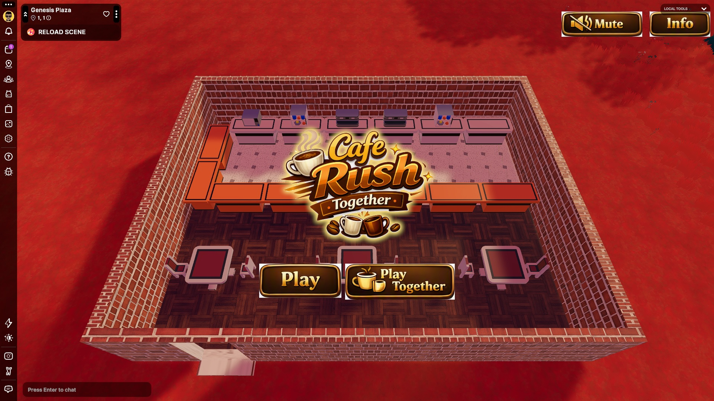
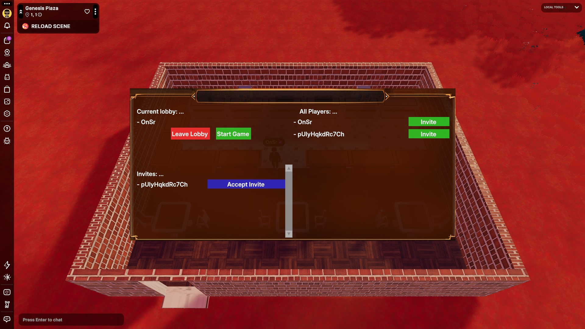
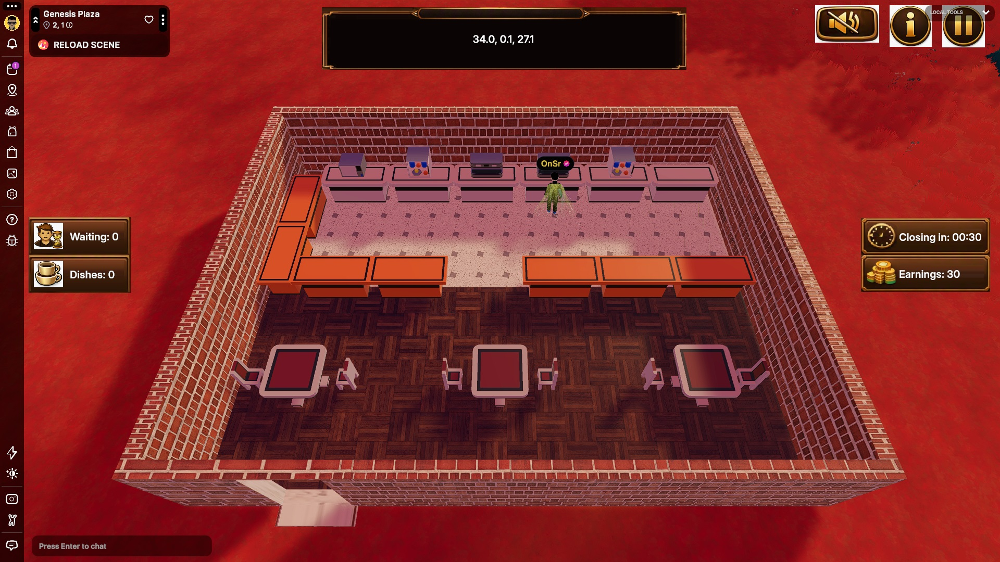

# Decentraland Buildathon 2026 Entry

## Cafe Hangout

This project contains assets for a very simple cafe. It can be used as a location to hangout.

Initially, the idea was to create a multiplayer game. Players would work as cafe staff, taking orders from clients, brewing coffee, serving food, cleaning the shop and more. A lobby infrastructure and a very simple UI is done but there was no time to create a gameplay. So, it is now just 3D models.

Visit world: onsr.dcl.eth

## Screenshots

